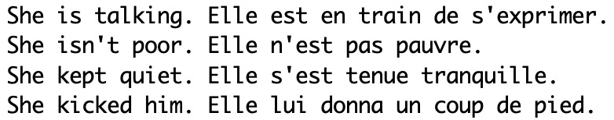
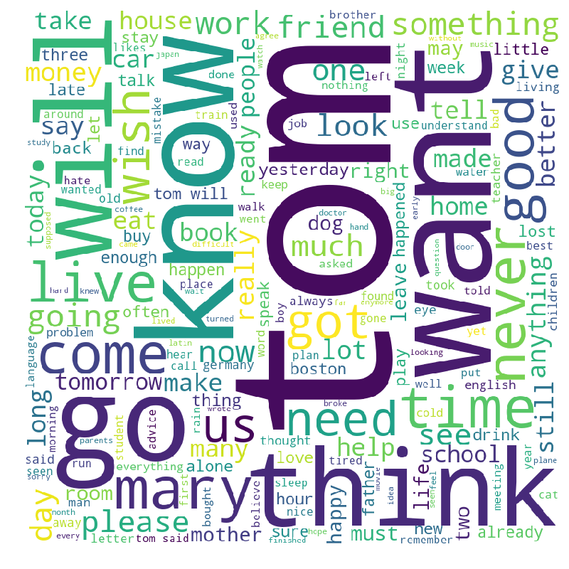
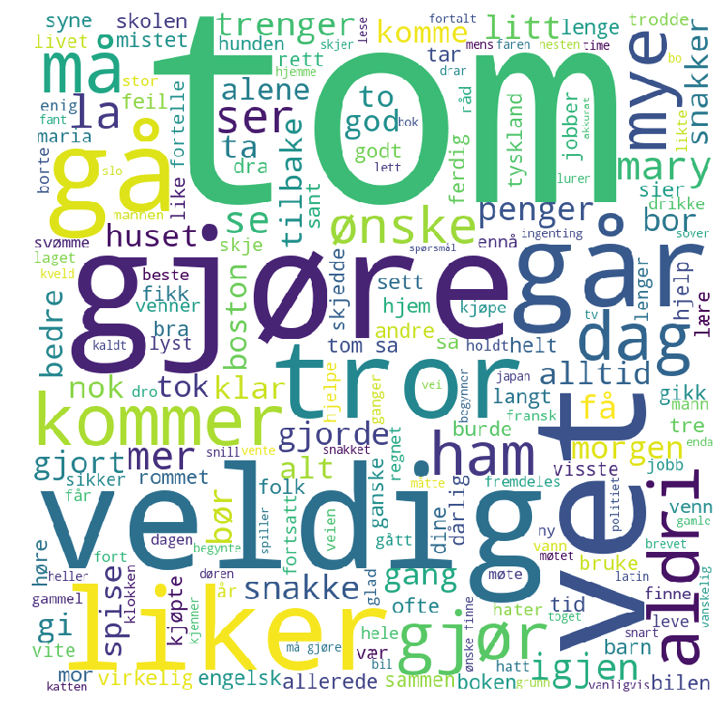
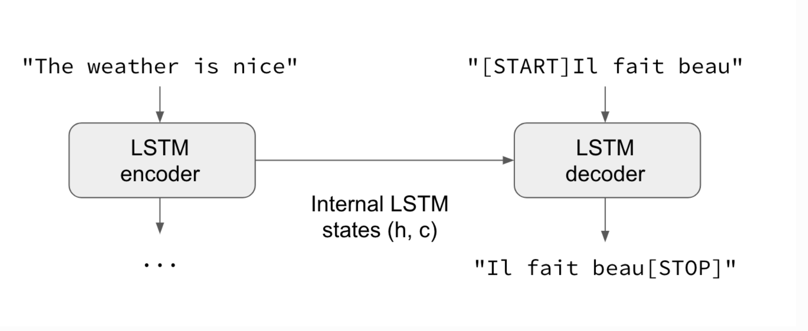
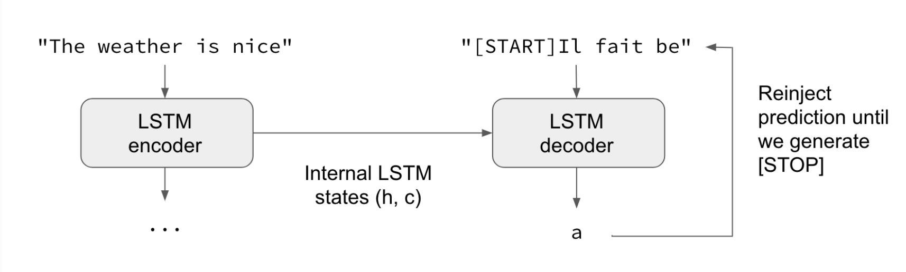
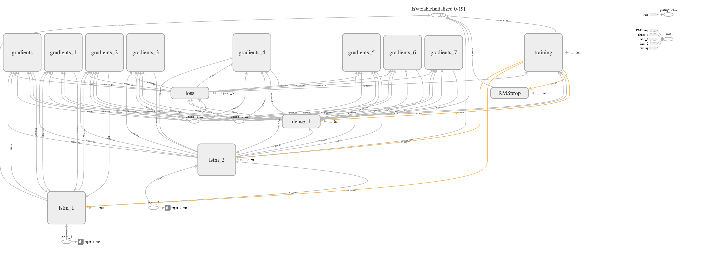
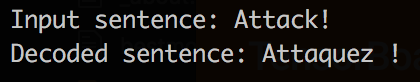
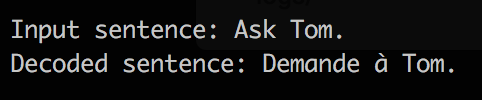
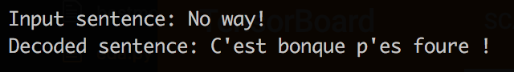

# Modeling Bilingual Sentence Pairs

#### Troy Kayne, Haven Melynn, Mathias Stensrud, & Jane Stout

Our goal was to make a machine learning model that would translate sentences from one language to another. Jane speaks a reasonable amount of French, so we decided to build a model that would translate English phrases to French phrases. In the proces, we also worked with a Norwegian/English dataset.

### Data
Our data were in a text file containing tab-delimited bilingual sentence pairs (see Figure 1 for examples) available at [ManyThings.org]. These are selected sentence pairs from the [Tatoeba Project]. Tatoeba is a collection of sentences and translations. See Figure 1 for example French/English sentence pairs.

**Figure 1. Sample bilingual sentence pairs (French/English).**

We created word clouds to get familiar with the data (see Figure 2a and 2b). Note that "Tom" was often the subject of sentence pairs.

**Figure 2a. Word cloud for English sentences**

**Figure 2b. Word cloud for Norwegian sentences**

### Modeling

The modeling technique we used was Sequence-to-Sequence. This is essentially two Long-short term memory (LSTM) models. LSTMs are known for their language translation ability. From wikipedia:

*LSTM networks are well-suited to classifying, processing and making predictions based on time series data, since there can be lags of unknown duration between important events in a time series. LSTMs were developed to deal with the exploding and vanishing gradient problems that can be encountered when training traditional RNNs.*

**Figure 3. Encoder stage: Takes in input sentences.**

**Figure 4. Decoder stage: Attempts to predict characters, given prior input.**

Our model used five layers: two input layers, two LSTM layers, and one dense layer. Figure 5 provides a spatial representastion of our model.

**Figure 5. Spatial representation of model from Tensorboard.**

As seen in Table 1, we ran three models to build our training model. We started training on an Norwegian/English dataset, with the goal of testing on our French/English dataset.

Our first model was an out-of-box model built on English/Norwegian sentences. We ran this model on approximately half of the sample using 30 epochs and a batch size of 64. This model produced a log loss of .57 and validation loss score of .92. We sought to improve on our model by including the full Norwegian/English sample (N = 5734) and doubling our epochs to 60, with a batch size of 64. This resulted in a log loss of .15 and validation loss of .79.

We then ran a model on the French/English dataset. This model was run on a sample of 10,000, with 20 epochs and a batch size of 64. Our log loss for this model was .05, with a validation loss of .79. Finally, we tested Model 3 (our final training model) on N = 5642 of the English/French dataset, with 50 epochs, and a batch size of 64. Our final model had a log loss of .13 and validation los of .56.

|         | Samples | Epochs | Batch size | Log loss | Validation loss |
|---------|---------|--------|------------|----------|-----------------|
| **Model 1** | 3100   | 30     | 64         | .57      | .92             |
| **Model 2** | 5642    | 60     | 64         | .15      | .79             |
| **Model 3** | 10000    | 20     | 64        | .05      | .79             |
| **Model 4** | 5642    | 50     | 64         | .13      | .56             |

**Table 1. Model parameters and loss metrics**

## Correct!

## Correct!

## Incorrect!

## Corrected:

## What did we learn?

We learned that stopwords are not consistent across language, websites, packages, etc.

We can't run a model trained on one bilingual dataset, to predict a second bilingual dataset. We had planned to train on the French/English dataest and run that model on the Norwegian/English dataset, but this is not possible because the models train and learn in different ways. Learning strategies for French/Englilsh is different than that of Norwegian/English.

It's easy to overfit LMST nodels. It's hard to balance training and testing loss (see Table 1).

[ManyThings.org]: http://www.manythings.org/anki/
[Tatoeba Project]: https://tatoeba.org/eng
